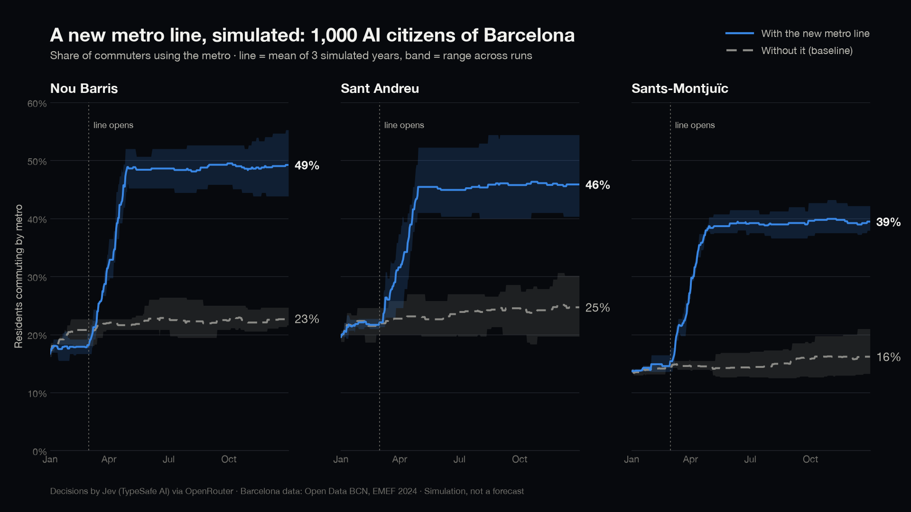

# Jev City

[](https://github.com/Manuel-Rucker01/demo-city/actions/workflows/ci.yml)
**Live demo:** https://manuel-rucker01.github.io/demo-city/ (replays logged real runs; no model
calls in the browser)

A simulation of Barcelona where every household's daily decisions come from **Jev**, TypeSafe AI's
"System One" model: instead of generating text, Jev answers typed questions (choice / score /
yes-no) with calibrated probabilities. The engine applies those decisions to a simple housing,
job, commerce and transport model and compares policy scenarios: *what happens if a new metro line
opens? if rents are capped?*

> **Status:** working prototype. Full-year runs with real Jev decisions (via OpenRouter and Vercel
> AI Gateway) are logged and replayable. **Nothing here is a forecast** and behaviour has not been
> validated against real outcomes. See [Limitations](#limitations).



## First result: a new metro line

Two identical cities (1,000 households, one simulated year, 3 seeds each, real Jev decisions via
OpenRouter): one unchanged, one where metro access improves in Nou Barris, Sant Andreu and
Sants-Montjuïc from day 60 (`scenarios/new_metro_line.yaml`).

| District | Metro share at year end, no line | With the line | Effect | Seed-to-seed noise (pooled std) |
|---|---|---|---|---|
| Nou Barris | 22.7 % | 49.2 % | +26.5 pts | 3.5 |
| Sants-Montjuïc | 16.2 % | 39.5 % | +23.3 pts | 2.8 |
| Sant Andreu | 24.7 % | 45.9 % | +21.2 pts | 5.3 |

Car commuting in Nou Barris falls from 15.9 % to 10.1 %; adoption builds gradually over the months
after opening (commuters notice the line over ~60 days and weigh their current habit). The line is
modelled **at district level** (every resident gets the same access boost, no stations), so the
effect is almost certainly larger than a real line would produce. Reproduce with
`jevcity batch --scenario scenarios/new_metro_line.yaml --seeds 3` and
`jevcity compare-batch`.

In a run without any policy, the city-wide commute mix stays within ~4 points of the 2024 EMEF
mobility survey it was calibrated to over the whole year.

## What it does

- **World:** all 10 Barcelona districts with population, age, household income and size,
  tenure, rents (INCASÒL deposits), tourist flats, cars, shops and district boundaries from open
  data, plus plausible values where no district-level data exists (see [Data](#data)).
- **Agents:** 1,000 synthetic households by default (tested to 10,000): age, occupation, wage,
  employment, tenure, rent or housing cost, children, car, commute mode and habit, shopping place,
  savings, satisfaction. Households also arrive in and leave the city.
- **Daily loop (1 tick = 1 day):** only households with an event that day decide (payday, lease
  renewal, job loss/offer, rent burden, school year, new transit, shop closures, tourism pressure,
  arrival). Each gets a compact state (~1,300 tokens incl. questions) and typed questions:
  action, destination (5 most relevant districts or leaving Barcelona), spending, satisfaction,
  and conditionally commute mode and shopping place.
- **Market:** monthly rents from vacancy and tourism pressure, job matching, shops opening and
  closing with local revenue, commuting costs, low-emission zones, new transit lines, tourist-flat
  phase-outs, rent caps.
- **Scenarios** in YAML (`scenarios/`), composable with `extends`.
- **Replay:** every model call is logged; any run can be replayed without calling Jev again.
- **Web view:** dark, video-ready map + charts comparing two runs side by side, with a recording
  mode and a Playwright/ffmpeg recorder (`tools/recorder/`).

## Quick start

Requirements: Python 3.12+, [uv](https://docs.astral.sh/uv/), Node 20+.

```bash
uv sync
uv run pytest                      # full test suite
uv run jevcity run --scenario scenarios/base.yaml --run-id base-mock
uv run jevcity run --scenario scenarios/rent_cap_gracia.yaml --run-id rent_cap_gracia-mock
uv run jevcity compare runs/base-mock runs/rent_cap_gracia-mock
uv run jevcity export-web runs/base-mock runs/rent_cap_gracia-mock

cd web && npm i && npm run dev     # open ?run=base-mock&compare=rent_cap_gracia-mock
```

A 1,000-agent, 365-day run takes about 2.5 s in mock mode.

Recording for video: `?record=1&run=base-mock&compare=rent_cap_gracia-mock&speed=4` at 1920×1080
(see `web/README.md`).

## Multi-seed batches

With 1,000 agents (~130–290 per district), a single run's differences can easily be noise, not
policy effect (see [Limitations](#limitations)). `jevcity batch` runs the same scenario at
several seeds and reports mean/std/min/max per district, so you can tell a real effect from
seed-to-seed variance:

```bash
uv run jevcity batch --scenario scenarios/base.yaml --seeds 5 --batch-id base-batch
uv run jevcity batch --scenario scenarios/rent_cap_gracia.yaml --seeds 5 --batch-id rent_cap-batch
uv run jevcity compare-batch runs/base-batch runs/rent_cap-batch
```

Each seed lands in its own ordinary run directory, `runs/<batch-id>/s<seed>/`, readable by
`jevcity compare`/`export-web` like any other run. `runs/<batch-id>/batch_summary.json` holds
the cross-seed aggregates: per-district final-metric mean/std/min/max (including per-mode
`mode_share`), per-tick time series (mean/min/max) for `avg_rent`, `avg_satisfaction` and
`mode_share` per mode, and total `usage` summed over every seed.

`--seeds N [--seed-start 1]` picks the seed range (`seed_start .. seed_start+N-1`). `--parallel P`
(1–4, default 1) runs up to P seeds concurrently as asyncio tasks in the same process (not
subprocesses). Each concurrent run builds its own Jev backend/rate limiter, so **`--parallel P`
against a paid provider multiplies the effective request rate by up to P** - the batch's
pre-flight cost estimate says so, and `--yes` is required exactly like `run`. A batch can be
re-launched after a crash: any seed whose `summary.json` already exists is skipped, not re-run.
A seed that fails does not stop the others; failures are listed in `batch_summary.json["failed"]`.

`jevcity compare-batch BATCH_A BATCH_B [--metric NAME]` prints, per district and metric,
`effect = mean_B - mean_A` against `noise = pooled std` (`sqrt((std_A² + std_B²) / 2)`), flagging
`CLEAR` when `|effect| > 2 x noise`. This is a rough heuristic, not a formal significance test -
with 3 seeds especially, read it as a signal to investigate, not a verdict.

`jevcity export-web` accepts a batch directory in place of (or alongside) run directories: it
expands it to each seed's run (so the web can show one representative run at a time) and copies
`batch_summary.json` to `web/public/runs/<batch-id>/` for later use (e.g. uncertainty bands).

## Providers

Jev is available directly and through two gateways. Pick one with `JEV_PROVIDER` (or
`--provider`); the rest of the code never knows which one is in use.

| `JEV_PROVIDER` | Key env var | Endpoint used | Notes |
|---|---|---|---|
| `mock` (default) | none | none | Weighted random answers from hand-written priors. Costs are *estimated*. |
| `typesafe` | `TYPESAFE_API_KEY` | `api.typesafe.ai/v1/systemone` | Reports the exact model version. New signups paused as of 2026-09-22. |
| `openrouter` | `OPENROUTER_API_KEY` | `openrouter.ai/api/v1/systemone` | Reports exact version and `usage.cost`. 32k context. |
| `vercel` | `AI_GATEWAY_API_KEY` | `ai-gateway.vercel.sh/typesafe/v1/systemone` | Reports billed cost and `marketCost`; **does not report the exact Jev version**. Native `/v1/evaluate` (`boolean` questions) also supported via `wire: vercel_evaluate`. |

URLs, rate limits, context sizes and prices live in `config/providers.yaml`, not in code, and
can be overridden per scenario (`jev.overrides`) or with `JEV_RPM_LIMIT`, `JEV_TPS_LIMIT`,
`JEV_MODEL`, `JEV_BASE_URL`. Undocumented provider behaviour is listed as `todo` there
(`uv run jevcity providers`).

The adapter throttles on requests/min and tokens/s, backs off exponentially on 408/429/5xx/529
(honouring `retry-after`), slows down adaptively after a 429, stops at `jev.max_cost_usd`, and
logs the exact model string of every response (`models_seen`), warning if it changes mid-run.

Paid providers require `--yes`:

```bash
uv run jevcity estimate --scenario scenarios/base.yaml --provider openrouter
JEV_PROVIDER=openrouter uv run jevcity run --scenario scenarios/base.yaml --yes
uv run jevcity run --scenario scenarios/base.yaml --replay-from runs/<id>/jev_calls.ndjson.gz
```

### Cost and speed (measured)

Real runs through Vercel AI Gateway (2026-09-24, 250 agents × 120 days, two scenarios, 2,229
calls, 0 failed): ~1,300 input tokens per call (state + 4 questions), ~200–300 ms at the
provider, ~20 calls/min effective on a free-credit key (Vercel advertises
`x-ratelimit-limit-requests: 30`; 429s say the upstream provider is under high demand).

At $0.042 per million input tokens (output is free), from a calibrated 1,000-agent year:

| Setup | Calls per scenario | Cost per scenario | Time at ~20 calls/min | Time at 1,080 calls/min* |
|---|---|---|---|---|
| 500 agents × 365 days | ~6,500 | ~$0.35 | ~5.5 h | ~6 min |
| 1,000 agents × 365 days | ~12,900 | ~$0.71 | ~11 h | ~12 min |
| 10,000 agents × 365 days | ~129,000 | ~$7 | days | ~2 h |

\* TypeSafe's published limit (1,200/min) at 90 %. OpenRouter and Vercel publish no Jev limits.

### Batching several agents per call (not recommended yet)

`batching: throughput` packs K agents into one state. Measured through Vercel on 2026-09-24:

- **More than 32 questions in one call returns HTTP 503** (undocumented; 32 works, 33 fails
  regardless of state size). With 4 questions per agent, K ≤ 8; the adapter enforces this via
  `max_questions_per_request` in `config/providers.yaml`.
- **Even within the limit, large calls are unreliable:** sequential probes returned 503 for
  3/8 calls at K=4, 4/8 at K=5 and 4/8 at K=8, versus 0/5 at K=1. Retries eventually succeed but
  each attempt counts against the rate limit, so the real speed-up is about 2×, not K×.
- **Answer fidelity at K>1 is unmeasured** (the A/B script `scripts/ab_batching.py` could not
  complete because of the 503s). Jev's docs warn that long states reduce accuracy.

So the default stays `quality` (K=1).

### How answers become actions

`jev.decision_policy`:
- `sample` (default): draw the action from Jev's calibrated probabilities, deterministically
  per (seed, tick, agent). This keeps minority behaviour in the population instead of collapsing
  every similar agent onto the most likely option.
- `argmax`: always take the top option.
- `gate`: take the top option, unless `confidence` is below `confidence_threshold`, then stay.

## Data

`scripts/fetch_opendata.py` rebuilds `data/processed/` from Open Data BCN. Full provenance is in
[`data/processed/SOURCES.md`](data/processed/SOURCES.md).

| Field | Source |
|---|---|
| Population, age structure | Open Data BCN `pad_mdbas_edat-q` (padró 2025) |
| Household size | Open Data BCN `pad_dom_mdbas_n-persones` (2025) |
| Income per capita (disposable) | Open Data BCN `renda-disponible-llars-bcn` (2023) |
| Income per household (gross) | Open Data BCN `atles-renda-bruta-per-llar` (INE Atlas, 2023) |
| Average rent of new contracts | Generalitat / INCASÒL rental deposits (2025 annual mean) |
| Owner-occupied share | Cens de Població i Habitatges (2011, latest district-level table found) |
| Shops | Open Data BCN `cens-locals-planta-baixa-act-economica` (2024) |
| Transit score | Derived: density of transit access points (Open Data BCN `transports`, 2025) |
| District boundaries | Open Data BCN `20170706-districtes-barris` (2017) |
| **Unemployment, jobs per resident, vacancy** | **Plausible hand-set values** (unemployment anchored to the 2025 city-wide rate): no machine-readable district-level dataset found |

Population model: every agent is a household head. Ownership follows the district owner share
exactly, weighted towards older and higher-income households; owners pay a fixed housing cost
(mortgage if under 55, fees otherwise), get no lease renewals and are unaffected by rent caps.
Unemployment, tenure and occupation mix match the district inputs exactly (quota allocation),
so even small runs reproduce them. Median renter rent burden at start: 30–38 % by district.

## Limitations

This is a demo and a research sandbox, **not a validated model**. Be careful with any conclusion.

- **Not validated against reality.** Neither the market rules nor the agents' behaviour have been
  calibrated or back-tested against observed Barcelona data. The rent cap result shows what *this*
  model does, not what a real cap would do.
- **Mock vs real runs.** Mock runs use hand-written priors (`src/jevcity/prompts/questions.py`)
  and say nothing about how Jev decides; only runs logged with a real provider (see
  `usage.models_seen` in each run) reflect Jev. Jev is calibrated for its own training tasks, not
  for predicting Barcelona households.
- **Some district inputs are still invented.** Unemployment by district, job locations and
  vacancy are plausible guesses, labelled as such; tenure comes from the 2011 census; the transit
  score is a crude density proxy (it ranks Gràcia below Nou Barris because Gràcia's area
  includes large hillside and park areas).
- **Simplified economy.** Owners never buy (they can only sell and rent), there is no
  migration in or out of the city, no construction, no tourism or short-term lets, and firms are just job slots. Rent
  dynamics are a vacancy rule with fixed parameters that were tuned by hand to stay in a
  plausible range.
- **Small numbers.** 1,000 agents means ~130–290 per district, so a handful of moves shifts
  vacancy and rents. Use several seeds before reading anything into differences.
- **Jev caveats.** Jev is strongest in English, weak at arithmetic (all numbers are pre-bucketed
  in code), and its probabilities are calibrated for its training tasks, not for predicting
  Barcelona residents. Synthetic survey or market-research use would need validation against real
  panels first.
- **Provider gaps.** Vercel doesn't report which Jev version answered, OpenRouter and Vercel
  don't publish Jev rate limits, and the confidence formula used to fill gaps comes from an
  example in TypeSafe's docs (see `config/providers.yaml`).

## Layout

```
config/providers.yaml     provider URLs, limits, prices, TODOs
scenarios/*.yaml          scenarios (extends + deep merge)
data/processed/           district data + geojson + SOURCES.md
src/jevcity/types.py      shared contracts (everything that crosses modules or hits disk)
src/jevcity/world/        data loader, market dynamics
src/jevcity/population/   synthetic population
src/jevcity/events/       who decides today
src/jevcity/prompts/      state + typed questions, answer parsing, mock priors
src/jevcity/jev/          provider adapter: codecs, rate limiting, retries, cost, mock, replay
src/jevcity/engine/       tick loop, district snapshots
src/jevcity/runlog/       runs/<id>/{meta,agents,summary}.json, ticks.ndjson, jev_calls.ndjson.gz
web/                      replay viewer (Vite, deck.gl, MapLibre, ECharts)
docs/CONTRACTS.md         module contracts
```
